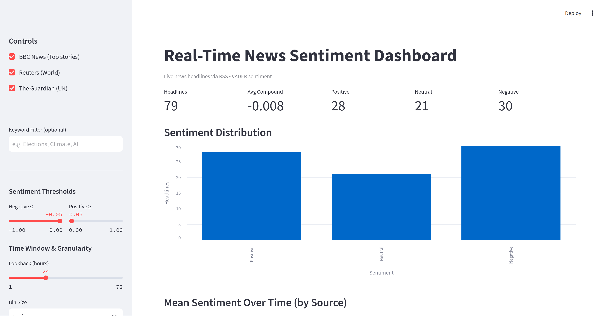
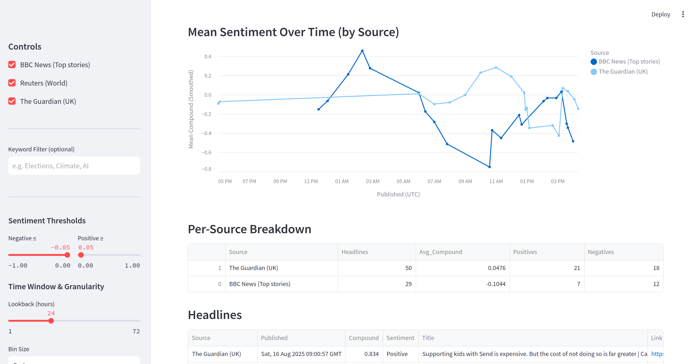
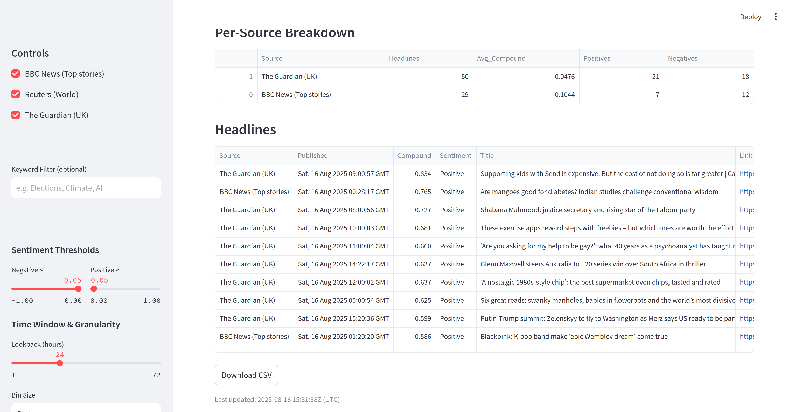

# Real-Time News Sentiment Dashboard

A lightweight Streamlit app that pulls **live news headlines via RSS** (BBC, Reuters, Guardian), runs **VADER sentiment analysis**, and visualises **distribution, trends over time, and per-source breakdowns**.

HTTPS feeds, adjustable thresholds, keyword filtering, and CSV export make this a handy real-time monitor of news tone.

---





---

## ✨ Features
- **Live ingest via RSS** (BBC/Reuters/Guardian) with caching (5-min TTL) + **Fetch Latest Headlines** button
- **VADER** sentiment (NLTK) with **tunable thresholds** (negative/positive)
- **Keyword filter** (case-insensitive)
- **Time window & binning**: choose lookback (e.g. 24 h) and granularity (1 min–1 h) with **smoothed mean** per source
- **Exclude imputed timestamps** (feeds that omit dates are defaulted to “now” — you can hide those)
- **Charts** in Altair: sentiment distribution + mean sentiment over time (by source)
- **Per-source breakdown** table
- **Clickable links** and **CSV export**

---

## Quick start

### 1) Create a virtual environment
```bash
python -m venv .venv
# macOS/Linux
source .venv/bin/activate
# Windows (cmd)
# .venv\Scripts\activate
# Windows (PowerShell)
# .venv\Scripts\Activate.ps1
```
### 2) Install dependencies
```bash
python -m pip install --upgrade pip
pip install -r requirements.txt
```

### 3) Run the app
```bash
python -m streamlit run app.py
```

## Controls (sidebar)
- Sources: toggle BBC / Reuters / Guardian
- Keyword Filter: e.g. Elections, Climate, AI
- Sentiment Thresholds: adjust negative/positive cut-offs
- Time Window & Granularity: pick lookback hours and bin size (1 min → 1 h)
- Exclude undated items: remove headlines with imputed “now” timestamps
- Fetch Latest Headlines: force a refresh (cache also auto-refreshes every 5 min)

## How it works
- Fetch RSS feeds with feedparser (capped to 50 entries per source).
- Normalise publish time → published_dt (UTC); mark undated items.
- Analyse headline text with VADER → compound score + label (Negative / Neutral / Positive).
- Visualise KPIs, distribution bar chart, and a smoothed mean-over-time line chart.
- Explore per-source stats; open links; download CSV.

## Notes & limitations
- Headlines only (no article body) for speed and simplicity.
- RSS feeds provide recent items; longer history requires persistence (not enabled by default).

- VADER is lexicon-based and very fast, but less nuanced than transformer models.
